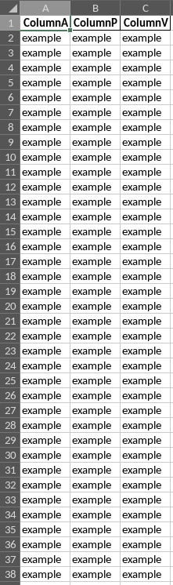

<h1 align="center">
  <a href="https://github.com/magnafoco/csv2excel">
    
  </a>
</h1>

<div align="center">
  CSV2Excel
  <br />
  <a href="#about"><strong>Explore the screenshots »</strong></a>
  <br />
  <br />
  <a href="https://github.com/magnafoco/csv2excel/issues/new?assignees=&labels=bug&template=01_BUG_REPORT.md&title=bug%3A+">Report a Bug</a>
  ·
  <a href="https://github.com/magnafoco/csv2excel/issues/new?assignees=&labels=enhancement&template=02_FEATURE_REQUEST.md&title=feat%3A+">Request a Feature</a>
  ·
  <a href="https://github.com/magnafoco/csv2excel/issues/new?assignees=&labels=question&template=04_SUPPORT_QUESTION.md&title=support%3A+">Ask a Question</a>
  <br>
  <br>
  <a href="https://www.buymeacoffee.com/magnafoco" target="_blank"></a>
</div>
<br>

<details open="open">
<summary>Table of Contents</summary>

- [About](#about)
  - [Built With](#built-with)
- [Getting Started](#getting-started)
  - [Prerequisites](#prerequisites)
  - [Installation](#installation)
- [Usage](#usage)
- [Roadmap](#roadmap)
- [Support](#support)
- [Project assistance](#project-assistance)
- [Contributing](#contributing)
- [Authors \& contributors](#authors--contributors)
- [Security](#security)
- [License](#license)

</details>

---

## About

**CSV2Excel** is a simple script written in Python 3, is developed to receive a CSV file as input parsing it returning the column headers inside with an index. The user will be able to select the column index and an XLSX file will be created with only the selected data.<br>
It can be used to perform data analysis quickly or automate processes, like export big reports from Vulnerability Assessment softwares and retrieve easily only necessary data from it.

<details>
<summary>Screenshots</summary>
<br>

|                               Start from                                |                               End to                               |
| :-------------------------------------------------------------------: | :--------------------------------------------------------------------: |
|  |  |

</details>

### Built With

- [Python 3](https://www.python.org)
- [Pandas](https://pandas.pydata.org)

## Getting Started

### Prerequisites

First things you need is Python 3 follow this official guide to install it: https://wiki.python.org/moin/BeginnersGuide/Download.<br>
The recommended method to install dependencies and use **CSV2Excel** is by using Pip.

1. Ensure that you have pip installed with:

    ```Bash
    pip --version
    ```

    if don't return an error then you have pip and you can proceed, else run:

    ```Bash
    python3 -m pip
    ```

    or follow this official guide https://pip.pypa.io/en/stable/installation

2. Run the following commands to install pandas and openpyxl:

    ```Bash
    python3 -m pip install pandas
    ```
    ```Bash
    python3 -m pip install openpyxl
    ```

### Installation

Clone the repo:

```Bash
git clone https://github.com/magnafoco/csv2excel
```

## Usage

Make sure you are into the project folder **CSV2Excel** or go into with `cd csv2excel`.

```Bash
python3 csv2excel.py --input <filename.csv>
```


## Roadmap

See the [open issues](https://github.com/magnafoco/csv2excel/issues) for a list of proposed features (and known issues).

- [Top Feature Requests](https://github.com/magnafoco/csv2excel/issues?q=label%3Aenhancement+is%3Aopen+sort%3Areactions-%2B1-desc) (Add your votes using the 👍 reaction)
- [Top Bugs](https://github.com/magnafoco/csv2excel/issues?q=is%3Aissue+is%3Aopen+label%3Abug+sort%3Areactions-%2B1-desc) (Add your votes using the 👍 reaction)
- [Newest Bugs](https://github.com/magnafoco/csv2excel/issues?q=is%3Aopen+is%3Aissue+label%3Abug)

## Support

Contact me [here](mailto:lists.sitcom_0x@icloud.com).

Reach out to the maintainer at one of the following places:

- [GitHub issues](https://github.com/magnafoco/csv2excel/issues/new?assignees=&labels=question&template=04_SUPPORT_QUESTION.md&title=support%3A+)
- Contact options listed on [this GitHub profile](https://github.com/magnafoco)

## Project assistance

If you want to say **thank you** or/and support active development of CSV2Excel:

- Add a [GitHub Star](https://github.com/magnafoco/csv2excel) to the project.
- Write interesting articles about the project on [Dev.to](https://dev.to/), [Medium](https://medium.com/) or your personal blog.

## Contributing

First off, thanks for taking the time to contribute! Contributions are what make the open-source community such an amazing place to learn, inspire, and create. Any contributions you make will benefit everybody else and are **greatly appreciated**.


Please read [our contribution guidelines](docs/CONTRIBUTING.md), and thank you for being involved!

## Authors & contributors

The original setup of this repository is by [magnafoco](https://github.com/magnafoco).

## Security

CSV2Excel follows good practices of security, but 100% security cannot be assured.
CSV2Excel is provided **"as is"** without any **warranty**. Use at your own risk.

_For more information and to report security issues, please refer to our [security documentation](docs/SECURITY.md)._

## License

This project is licensed under the **MIT license**.

See [LICENSE](LICENSE) for more information.